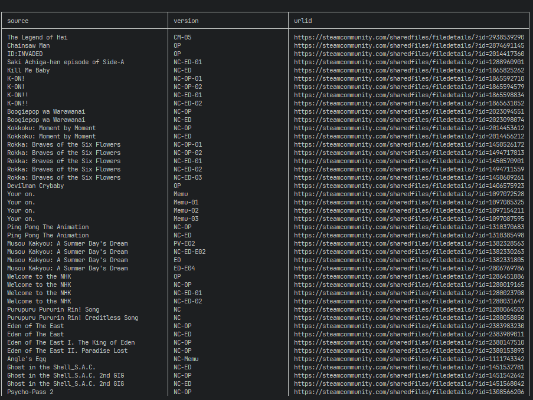

# WALLPAP-ENG-resource


resource of [Wallpaper Engine](https://www.wallpaperengine.io/).  
almost all come from favorite anime. uploaded them many years ago, and recently carried out "garbage collection". the data table is split into `table.md` and some `csv`.  
used [shields.io](https://shields.io/) to slowly show some data. see [data.md](/data.md).  
used [markserv](https://github.com/markserv/markserv) to preview.  

## note

1. the naming of early wallpaper-files generally uses "Chinese name" + "original name".
2. generally, the first frame with a certain degree of recognition is intercepted as the video cover.
3. The earlier files basically used [ShanaEncoder](https://sourceforge.net/projects/shanaencoder/) to batch compression. later, also used with [HandBrake](https://handbrake.fr), [LosslessCut](https://github.com/mifi/lossless-cut).
4. the later description is only filled in the "English" language by default. but do not delete or correct the content in other languages. because if cannot carried out the batch operation, things will be troublesome.

## no license

all these videos on [steamcommunity](https://steamcommunity.com/), their copyrights belong to the original producer, etc 👮

## magic

long and good 👺

```cmd
curlie -k https://raw.githubusercontent.com/scillidan/WALLPAP-ENG-resource/main/table.md ^
  | sd "\[\d{10}\]\(" "" ^
  | sd "(\)\|\S+subsc)" "|![](//img.shields.io/steam/subsc" ^
  | mdtable2csv ^
  | sd "//steamc" "https://steamc" ^
  | xsv select source,version,urlid ^
  | csview
````

replace `^` with `\` in `bash`.



## todo

- [x] merge collections on steamcommunity
- [x] supplement the information of song
- [ ] write about #magic 🤡